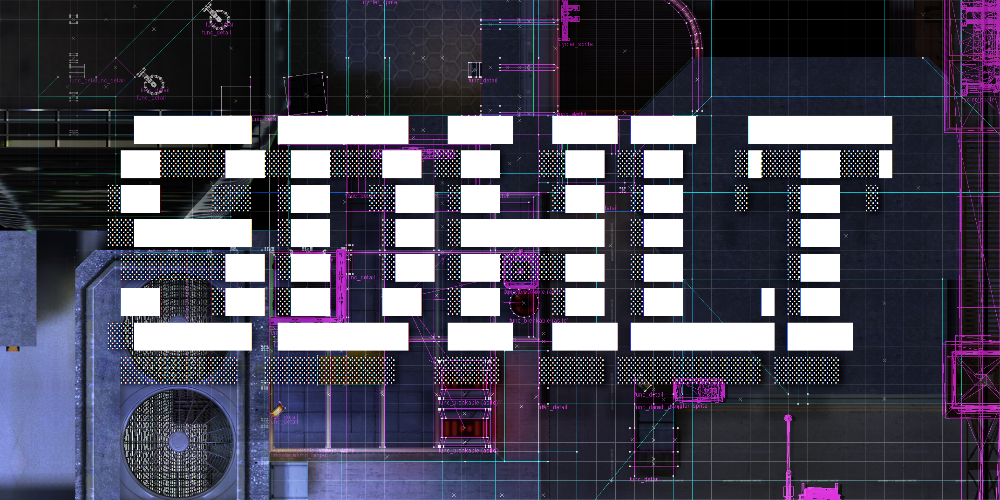

Half-Life engine map compile tools, based on Vluzacn's ZHLT v34 with code contributions from various contributors. Based on Valve's version, modified with permission.

New features include shadows from studiomodels, new entities, additional tool textures, ability to extend world size limits, portal file optimisation for J.A.C.K. map editor and minor algorithm optimization.

## How to install

1. Open the configuration dialog of your map editor or batch compiler.
2. Set CSG, BSP, VIS, RAD tool paths to *sdHLCSG.exe*, *sdHLBSP.exe*, *sdHLVIS.exe*, *sdHLRAD.exe*, use the *_x64.exe* editions if running on 64-bit.  
3. Add *sdhlt.wad* into your wad list. This is required to compile maps.
4. Add *sdhlt.fgd* into your fgd list.

The main benefit of the 64-bit version is no memory allocation failures, because the 64-bit tools have access to more than 2GB of system memory.

## Features

### Studiomodel shadows

Entities with a `model` keyvalue, such as *env_sprite* or *cycler_sprite*, support the use of `zhlt_studioshadow 1` to flag the studiomodel as opaque to lighting. Additionally, `zhlt_shadowmode n` is used to control the shadow tracing mode.  
The default `1` will trace for each triangle and supports transparent textures.  
Setting `2` doesn't support transparency, but it traces the planes bbox for each triangle, the slowest but usually higher quality for some models.  
Setting `0` disables tracing and uses the mesh bbox instead.

To implement these into your own fgd file for SmartEdit, use the template at the top of *sdhlt.fgd*. If the new shadow covers the origin and makes it too dark, set a custom `light_origin` on the entity or move the mesh origin point externally.

### Entities

- *info_portal* and *info_leaf* ared used to create a portal from the leaf the *info_portal* is inside, to the selected leaf the *info_leaf* is inside. Forces target leaf to be visible from the current one, making all entities visible.
- *info_minlights* used to set minlights for textures, works on world geometry too. Works similarly to `_minlight` but per-texture.

### Textures

- Support for `%` texture flag, sets the minlight for this texture. **%texname** alone is equivalent to `_minlight 1.0`, while **%`#`texname** where **`#`** is an integer in a range of `0-255`.
- **BEVELHINT** texture, which acts like **SOLIDHINT** and **BEVEL**. Eliminates unnecessary face subdivision and bevels clipnodes at the same time. Useful on complex shapes such as terrain, spiral staircase clipping, etc.
- **SPLITFACE** texture. Brushes with this texture will subdivide faces they touch along their edges, similarly to `zhlt_chopdown`.
- **cur_tool** textures, which act like **CONTENTWATER** and *func_pushable* with a speed of `2048 units/s` in -Y. This texture is always fullbright.

### Compile parameters

- `-pre25` RAD parameter overrides light clipping threshold limiter to `188`. Use this when creating maps for the legacy pre-25th anniversary engine without worrying about other parameters.
- `-extra` RAD parameter now sets `-bounce 12` for a higher quality of lighting simulation.
- `-worldextent n` CSG parameter. Extends map geometry limits beyond `+/-32768`.
- Portal file reformatting for J.A.C.K. map editor, allows for importing the prt file into the editor directly after VIS. Use `-nofixprt` VIS parameter to disable.
- `-nowadautodetect` CSG parameter. Wadautodetect is now true by default regardless of settings.
- `-nostudioshadow` RAD parameter to ignore `zhlt_studioshadow` on studiomodels.

## Planned
- **BLOCKLIGHT** texture, cast shadows without generating faces or cliphulls.
- Optimization for `BuildFacelights` and `LeafThread`
- Res file creation for servers
- Split concerns into their own libraries instead of repeating infrastructure and util code
- Full tool texture documentation
