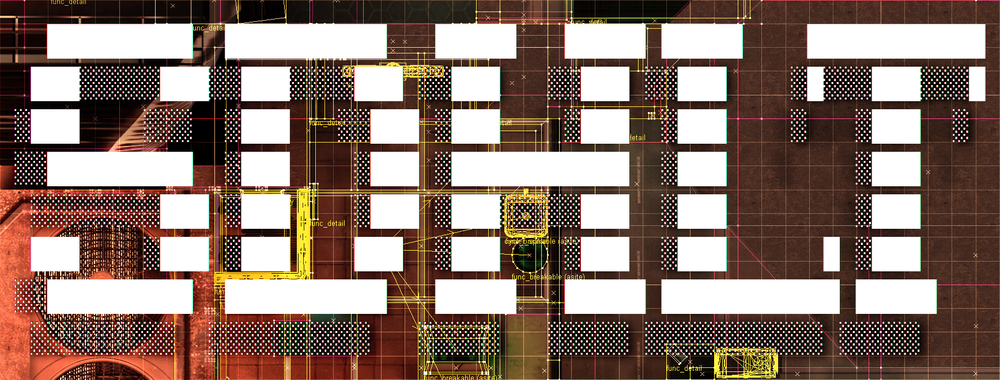

Half-Life engine map compile tools, based on Vluzacn's ZHLT v34 with code contributions from various contributors. Based on Valve's version, modified with permission.

New features include ambient occlusion, opaque studio models, new entities, tool textures, extendable world size limits, portal file optimisation for J.A.C.K. map editor and other minor bug fixes and improvements.

## Usage

1. Open the configuration dialog of your map editor or batch compiler.
2. Set CSG, BSP, VIS, RAD tool paths to *sdHLCSG.exe*, *sdHLBSP.exe*, *sdHLVIS.exe*, *sdHLRAD.exe*, use the *_x64.exe* editions if running on 64-bit.  
3. Add *sdhlt.wad* into your wad list. This is required to compile maps.
4. Add *sdhlt.fgd* into your fgd list.

> [!NOTE]
> The main benefit of the 64-bit version is no memory allocation failures, because the 64-bit tools have access to more than 2GB of system memory.

## Features

### Ambient occlusion
Simulates soft contact shadows with `-ao` darkening corners, crevices and around opaque objects where surfaces meet, with support for transparent textures. For every lightmap sample, RAD will trace a bunch of rays across a hemisphere around the surface normal and measures how many will escape. Each direction is weighted by its solid angle, and its angle to the normal (flat directions count more, grazing ones less). The settings are balanced by default, but you might want to customize `-aoscale #` and `-aogain #`.

### Studio model shadows
Studio models (.mdl) can be flagged opaque and cast shadows from any entity with a `model` keyvalue, such as *env_sprite* or *cycler_sprite*. The keyvalue `zhlt_studioshadow 1` enables this, and `zhlt_shadowmode #` sets the shadow tracing mode. Use the template at the top of *sdhlt.fgd* to implement these for SmartEdit.

The default shadow mode `1` will trace each triangle normally and supports transparent textures. Setting `2` doesn't support transparency, but traces each triangle with some extra thickness, which fills in the gaps between triangle seams for solid-looking shadows. Setting `0` only traces a bbox around each triangle. In practice, these union together into something close to the whole model's bbox.

> [!TIP]
> If the shadow covers the point underneath the model’s origin, this could affect its brightness in unwanted ways. Control it by setting a custom `light_origin` on the entity (or move the mesh origin internally).

### Other
- Percentage-closer filtering can anti-alias hard shadow edges. It also produces smooth contact darkening where surfaces are already more occluded as a side effect. Increases compile times, so use lower values first.
- Bilateral (edge-preserving) filtering can be enabled on blurred lightmap samples to fix thin shadows appearing like dotted lines due to light bleeding into shadows. 
- Deathmatch Classic maps can further push clipnode limits by removing clip hull 3. Not recommended in regular Half-Life 1 without your own Quake DM style mods.
- Minor performance boosts before tracing BuildFacelights, filtering direct lights by distance (exact inverse-square peak contribution threshold) and by surface facing.

### Compile parameters
#### CSG
- `-worldextent #` extends the world geometry limit, increase this if you get "brush outside world" errors. Default value of `65536` allows geometry in the range of `+/-32768`. Entities are limited to `+/-8192` by the engine.

#### BSP
- `-nohull3` disables generating clip hull 3, used for crouching and small pushables.

#### VIS
- `-nofixprt` disables J.A.C.K. related .prt file reformatting, allows for importing into Worldcraft directly after VIS.
   
#### RAD
- `-pre25` is an alias to override light clipping threshold limiter to `188`. Use this when creating legacy pre-25th anniversary maps.
- `-nostudioshadow` disables studio model shadow tracing.
- `-ao` enables ambient occlusion. Entities are only occluded if flagged opaque to light. Studiomodels are occluded based on `zhlt_shadowmode`. 
- `-aoscale #` sets how far the rays reach, i.e. where AO exists and the maximum distance at which geometry counts as occluding. Higher values make the dark bands reach further out from corners and look thicker. 
- `-aogain #` sets the exponent shaping the falloff curve, or how closely AO bands hug corners. If scale is the reach, gain is the distribution within that reach. Linear by default. `<1` spreads it further away. `>1` keeps AO only in the deepest corners while half-occluded areas shrink. 
- `-aolevel #` sets the quality, or density of ray directions traced across the hemisphere per luxel. Default `3` tests 66 ray directions for each luxel, which is enough for most maps. Lower values shouldn't be used for final compiles. The sampling levels map onto RAD's geodesic tables used for sky lighting. 

| Level | 1 | 2 | 3 | 4 | 5 | 6 | 7 | 8 |
|---|---|---|---|---|---|---|---|---|
| Directions | 6 | 18 | 66 | 258 | 1026 | 4098 | 16386 | 65538 |

- `-aominweight #` sets the ray-culling threshold as a fraction of total hemisphere weight, below which a ray is skipped. Values higher than `0` can speed up compile times but slightly loses occlusion from corners. Set this to `0` if your AO breaks or disappears entirely at extremely high sampling levels. 
- `-aostudiomode value` acts as a global `zhlt_shadowmode` override used for tracing AO in studio models. Options include `fast`, `normal` and `slow`. Using `fast` can speed up compile times without changing how actual shadows are cast. Default `inherit` uses the keyvalue from entity instead. 
- `-aoopacity #` controls AO visibility. Multiplies computed occlusion to form the final blend factor alpha. 
- `-aocolor r g b` controls the tint color of the AO. Darkens toward black by default, any other color tints the occlusion. Useful for stylized effects. 
- `-aostats` displays a chart of ambient occlusion statistics.
- `-blurclamp #` limits blur bleeding into shadow edges (bilateral filtering) with `#` as the suppression strength. Default `0.0` keeps classic blur, higher values caps how much a brighter sample contributes. `0.5` means any sample 5x brighter than the luxel is limited to 50% weight, `0.75` caps 2.5x brighter at 25%, etc.
- `-pcf #` sets anti-aliasing level for shadow edges. It traces `#²` shadow rays per lightmap texel (percentage-closer filtering). Includes contact darkening near occluded geometry. Default `1` disables this and uses one binary shadow test per sample, higher values increase compile times.

### Entities

- *info_portal* and *info_leaf* ared used to create a portal from the leaf the *info_portal* is inside, to the selected leaf the *info_leaf* is inside. Forces target leaf to be visible from the current one, making all entities inside it visible.
- *info_minlights* used to set minlights for textures, works on world geometry too. Works similarly to `_minlight` but per-texture.

### Textures

- Support for `%` texture flag, sets the minlight for this texture. **%texname** alone is equivalent to `_minlight 1.0`, while **%`#`texname** where **`#`** is an integer in a range of `0-255`.
- **BEVELHINT** texture, which acts like **SOLIDHINT** and **BEVEL**. Eliminates unnecessary face subdivision and bevels clipnodes at the same time. Useful on complex shapes such as terrain, spiral staircase clipping, etc.
- **SPLITFACE** texture. Brushes with this texture will subdivide faces they touch along their edges, similarly to `zhlt_chopdown`.
- **cur_tool** textures, which act like **CONTENTWATER** and *func_pushable* with a speed of `2048 units/s` in -Y. This texture is always fullbright.

## Planned
- [x] Optimization for BuildFacelights and MakeScales
- [ ] Optimization for LeafThread
- [ ] Tool textures, .res generation and more
- [ ] Full code and textures documentation
